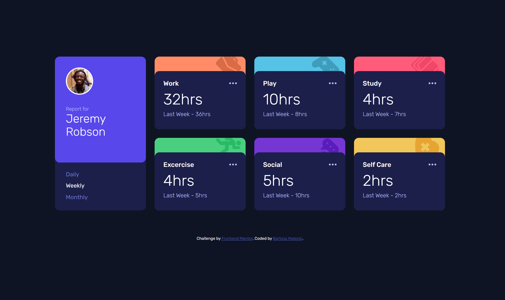

# Frontend Mentor - Time tracking dashboard solution

This is a solution to the [Time tracking dashboard challenge on Frontend Mentor](https://www.frontendmentor.io/challenges/time-tracking-dashboard-UIQ7167Jw). Frontend Mentor challenges help you improve your coding skills by building realistic projects.

## Table of contents

- [Overview](#overview)

  - [The challenge](#the-challenge)
  - [Screenshot](#screenshot)
  - [Links](#links)
  - [My process](#my-process)
  - [Built with](#built-with)
  - [Continued development](#continued-development)
  - [Useful resources](#useful-resources)

- [Author](#author)

## Overview

### The challenge

Users should be able to:

- View the optimal layout for the site depending on their device's screen size
- See hover states for all interactive elements on the page
- Switch between viewing Daily, Weekly, and Monthly stats

### Screenshot

### Links

- Solution URL: [Add solution URL here](https://your-solution-url.com)
- Live Site URL: [https://bartosz-malecki.github.io/time-tracking-dashboard-challenge/](https://bartosz-malecki.github.io/time-tracking-dashboard-challenge/)

## My process

### Built with

- Semantic HTML5 markup
- CSS custom properties
- Flexbox
- CSS Grid
- SCSS
- JavaScript
- Mobile-first workflow

### How to use it?

Click on `Use this template` button to generate a new repository based on this starter kit. After that clone it to your computer, go to the project directory in console and type `npm install`.

### Available scripts

`npm run start` - runs development mode

`npm run build` - runs build process for production

`npm run publish` - runs build process and publish the page using `gh-pages` branch

### Continued development

I want to improve my skills. I'll do a few more challenges from Frontend Mentor, and I want to learn some new stuff like CSS and JS frameworks. Maybe in the future I'll go to full stack dev.

### Useful resources

- [CSS Tricks](https://css-tricks.com) - This helped me for remembering CSS functionalities. I really liked this page and will use it going forward.
- [Udemy.com](https://udemy.com) - I used a few of my buyouts courses to check out some JS stuff.
- [Stackoverflow](https://stackoverflow.com/) - I used to find some useful advice.

## Author

- Website - [Add your name here](https://github.com/bartosz-malecki)
- Frontend Mentor - [@bartosz-malecki](https://www.frontendmentor.io/profile/bartosz-malecki)
